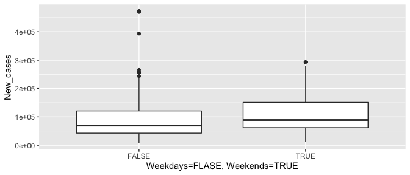

WHO COVID-19 Data Analysis: the ‘weekend effect’ in US and world
================
Tina Tan 914650494
03/12/2022

------------------------------------------------------------------------

## I. Introduction

It had several articles and news reported that there was a “weekend
effect” in COVID-19 cases and mortality. According to ABC News, the Ohio
Department of Health found that the number of new cases reported was
lowest on the weekends, and then the cases would rise throughout the
week, often peaking on Friday. Meanwhile, professor Lauren Hale from
Public Health at Stony Brook University School of Medicine also observed
this “weekend effect” weekly cycles occurring in the US and other
countries. Professor Lauren stated the reason for the “weekend effect”
occurring would including:1) fewer people getting tested on the
weekends; 2) fewer lab tests process on the weekends; 3) delay in
reporting lags on weekends; 4) weekend lead to more initial symptoms on
weekdays. In this report, I utilized the WHO COVID-19 data to extent the
similar research and see if “weekend effect” also occurs in whole U.S.
and even the world regions.

------------------------------------------------------------------------

## II.Data Backgroud and Overview

The WHO COVID-19 data provided daily updates on global, regional, and
country-level COVID-19 cases and deaths. The data was collected every
day which starts from Jan 03,2020. By the date of this report, the data
totally contained 188620 observations with 8 variables. The 8 variables
were:

1.  Date_reproted: data of reported (year-month-day)
2.  Country_code: short alphabetic or numeric geographical codes
3.  Country name
4.  WHO_regin: African Region (AFR), Region of the Americas (AMR),
    South-East Asian Region (SEAR), European Region (EUR), Eastern
    Mediterranean Region (EMR), and Western Pacific Region (WPR)
5.  New_cases: number of new cases on the reported date
6.  Cumulative cases: cumulative cases by the reported date
7.  New_deaths: number of new deaths on the reported date
8.  Cumulative_deathes: cumulative deathes by the reported date

<!-- -->

    ## # A tibble: 189,272 × 8
    ##    Date_reported Country_code Country     WHO_region  New_cases Cumulative_cases
    ##    <date>        <chr>        <chr>       <fct>           <dbl>            <dbl>
    ##  1 2020-01-03    AF           Afghanistan Eastern Me…         0                0
    ##  2 2020-01-04    AF           Afghanistan Eastern Me…         0                0
    ##  3 2020-01-05    AF           Afghanistan Eastern Me…         0                0
    ##  4 2020-01-06    AF           Afghanistan Eastern Me…         0                0
    ##  5 2020-01-07    AF           Afghanistan Eastern Me…         0                0
    ##  6 2020-01-08    AF           Afghanistan Eastern Me…         0                0
    ##  7 2020-01-09    AF           Afghanistan Eastern Me…         0                0
    ##  8 2020-01-10    AF           Afghanistan Eastern Me…         0                0
    ##  9 2020-01-11    AF           Afghanistan Eastern Me…         0                0
    ## 10 2020-01-12    AF           Afghanistan Eastern Me…         0                0
    ## # … with 189,262 more rows, and 2 more variables: New_deaths <dbl>,
    ## #   Cumulative_deaths <dbl>

### New Cases

The spaghetti plot below briefly showed the total daily New_cases for
each WHO_region that provided an overview of the daily new cases trends.
In this case, the WHO_region was treated as the basic unit during
analysis. The New_case of countries from the same region would be summed
up and then compared to each other.

    ## # A tibble: 6 × 3
    ## # Groups:   Date_reported [1]
    ##   Date_reported WHO_region            sum_newcases
    ##   <date>        <fct>                        <dbl>
    ## 1 2020-01-03    Africa                           0
    ## 2 2020-01-03    Americas                         0
    ## 3 2020-01-03    Eastern Mediterranean            0
    ## 4 2020-01-03    Europe                           0
    ## 5 2020-01-03    South-East Asia                  0
    ## 6 2020-01-03    Western Pacific                  0

As seen in the plot, the daily new case was increasing as the date went.
During 2020-2021, all six regions kept the new cases under 500,000.
After Dec 2021, all six regions had a significant increase in new cases
due to the presence of the new COVID-19 variant, Omicron. At beginning
of Jan 2022, the Americas had around 2,000,000 daily new cases while
Europe had around 1,500,000 new cases.

### Case-mortality Rate

    ## # A tibble: 6 × 5
    ##   Date_reported WHO_region    Cumulative_cases Cumulative_deat… Case_mortality_…
    ##   <date>        <fct>                    <dbl>            <dbl>            <dbl>
    ## 1 2020-01-03    Eastern Medi…                0                0                0
    ## 2 2020-01-04    Eastern Medi…                0                0                0
    ## 3 2020-01-05    Eastern Medi…                0                0                0
    ## 4 2020-01-06    Eastern Medi…                0                0                0
    ## 5 2020-01-07    Eastern Medi…                0                0                0
    ## 6 2020-01-08    Eastern Medi…                0                0                0

On the other hand, Western Pacific and Eastern Mediterranean had high
rates in case_mortality_rate in the middle of 2020. However, the
case_mortality_ratea were decreasing in six regions as time went. It was
surprising that trends of case_mortality_rate were opposite with the
trends of the new cases in six regions.

------------------------------------------------------------------------

## III. Descriptive analysis - WHO COVID-19

The following dataset “covid” would be used to analyze whether the
“weekend effect” also coccus in US and world. The dataset selected the
related variables from original data set. Also, it was added new column
“Weekday_or_Weekend” in the selected data frame as indicators to
determine the date if it is a weekend or not. (Weekend = TRUE, Weekday =
FALSE)

    ## # A tibble: 6 × 5
    ##   Date_reported WHO_region            Country     New_cases Weekday_or_Weekend
    ##   <date>        <fct>                 <chr>           <dbl> <lgl>             
    ## 1 2020-01-03    Eastern Mediterranean Afghanistan         0 FALSE             
    ## 2 2020-01-04    Eastern Mediterranean Afghanistan         0 TRUE              
    ## 3 2020-01-05    Eastern Mediterranean Afghanistan         0 TRUE              
    ## 4 2020-01-06    Eastern Mediterranean Afghanistan         0 FALSE             
    ## 5 2020-01-07    Eastern Mediterranean Afghanistan         0 FALSE             
    ## 6 2020-01-08    Eastern Mediterranean Afghanistan         0 FALSE

## VI. USA: Descriptive and Inferetial analysis

### Descriptive analysis

Let’s focus on the daily new case in the USA! Since the article of Ohio
Department of Health was published in September 2021. So, I would like
to just focus the data on 2021 to see whether the “weekend effect” also
applies to the whole US in 2021. The following dataset “newcases_usa”
showed the reported data (including the weekend indicators) and
corresponding new cases. The plot below briefly showed the trend of the
daily new cases in 2021. Additionally, the boxplot shows the weekend has
a higher average daily new case than weekday. (Note: “Weekend
Effect”reflect the new cases in weekday \< weekend)

    ## # A tibble: 6 × 5
    ##   Date_reported WHO_region Country                  New_cases Weekday_or_Weekend
    ##   <date>        <fct>      <chr>                        <dbl> <lgl>             
    ## 1 2021-01-01    Americas   United States of America    237536 FALSE             
    ## 2 2021-01-02    Americas   United States of America    229181 TRUE              
    ## 3 2021-01-03    Americas   United States of America    227548 TRUE              
    ## 4 2021-01-04    Americas   United States of America    226218 FALSE             
    ## 5 2021-01-05    Americas   United States of America    204647 FALSE             
    ## 6 2021-01-06    Americas   United States of America    175024 FALSE

### Data transformation

Checking the histogram of response. The histogram showed right skewed
which the peak of the histogram lies on the left side of the center. In
this case, before fit a model for analyzing, I would like to use the log
transformation to make data normality.

### Inferential analysis

Next, we fit a regression a full linear model involving log(New_cases)
as response variable on the predictors “Weekday_or_Weekend”.

    ##                        Estimate Std. Error   t value     Pr(>|t|)
    ## (Intercept)            88138.52   4256.174 20.708391 1.881352e-63
    ## Weekday_or_WeekendTRUE 17079.58   7973.503  2.142043 3.285496e-02

i.e. 
*y**i**j* = *α* + *β* \* *x**w**k* + *ϵ**i**j*

where,
$$ \\begin{align\*}
\\hat\\alpha&\\approx 88138.52 \\\\
\\hat\\beta_1&\\approx 17079.58 \\\\
\\end{align\*} $$

Then, running a one-way ANOVA.

H0 : There is NO difference in the daily new cases between weekend and weekday in USA.
H1 : There is a difference in the daily new cases between weekend and weekday in USA.

    ## Analysis of Variance Table
    ## 
    ## Response: New_cases
    ##                     Df     Sum Sq    Mean Sq F value  Pr(>F)  
    ## Weekday_or_Weekend   1 2.1694e+10 2.1694e+10  4.5883 0.03285 *
    ## Residuals          363 1.7163e+12 4.7280e+09                  
    ## ---
    ## Signif. codes:  0 '***' 0.001 '**' 0.01 '*' 0.05 '.' 0.1 ' ' 1

From the output of one-way ANOVA, we could see that Weekday_or_Weekend
explained a significant variation in the new cases since its p-values
less than 0.05. Hence, in this case, we could conclude that the daily
new case related to weekend and weekday in the USA.

As seen in the Observed vs Fitted values plot, all data points fall into
the clusters on two sides since our predictor “Weekday_or_Weekend” was
binary variable. On the other, we can use the QQ-plot for checking the
normality. From the above QQ-plot, main points are located around the
theoretical dash line that showing *ϵ**i**j* are roughly
normally distrusted.But it still have heavy tail at the end.

## VI. All Country (World): Descriptive and Inferetial analysis

### Descriptive analysis

The dataset “newcases_wk” was used for analysis whether there is
“weekend effect” in new cases among the world. The time span of the
dataset from 2020-01-03 to 2020-03-12. In this databset, there was total
187 country, each country has two observations: the mean of daily new
case in weekend and weekdays. The country did not have two observation
would excused form the analysis, for example, Nicaragua only had the
mean of new case in weekend.

According the table below, we could quickly look at the different in
daily new case between weekend and weekday. Weekend (TRUE) has slight
less daily new cases than weekend (FLASE). On the other hand, the box
plot of average daily new case would also show that weekend and weekday
has similar average daily new case in whole world. In this case, I
removed outlines from dataset according to the boxplot.

    ## # A tibble: 2 × 2
    ##   Weekday_or_Weekend  mean
    ##   <lgl>              <dbl>
    ## 1 FALSE              2372.
    ## 2 TRUE               2551.

    ## # A tibble: 6 × 3
    ## # Groups:   Country [6]
    ##   Country                   Weekday_or_Weekend mean_newcases
    ##   <chr>                     <lgl>                      <dbl>
    ## 1 Saint Barthélemy          FALSE                       1.16
    ## 2 Saint Pierre and Miquelon FALSE                       1.52
    ## 3 Kiribati                  TRUE                        2.35
    ## 4 Anguilla                  TRUE                        2.70
    ## 5 Saint Martin              FALSE                       2.79
    ## 6 Tonga                     FALSE                       3.15

### Data transformation

In this case, before fit a model for analyzing, I would like to use the
log transformation to make data normality since the histogram had a
right skewed.

### Inferential analysis

    ##                           Estimate Std. Error    t value      Pr(>|t|)
    ## (Intercept)             4.82211986  0.1390530 34.6782920 4.148963e-115
    ## Weekday_or_WeekendTRUE -0.04693072  0.1974964 -0.2376282  8.123089e-01

Next, we fit a regression a full linear model involving
log(mean_newcases) as response variable on the predictors
“Weekday_or_Weekend”.

i.e. 
*y**i**j* = *α* + *β* \* *x**w**k* + *ϵ**i**j*

where,
$$ \\begin{align\*}
\\hat\\alpha&\\approx 4.82211986 \\\\
\\hat\\beta_1&\\approx -0.04693072 \\\\
\\end{align\*} $$

Then, tuning a one-way ANOVA.

H0 : There is NO difference in the global daily new cases between weekend and weekday.
H1 : There is a difference in the global daily new cases between weekend and weekday.

    ##                     Df Sum Sq Mean Sq F value Pr(>F)
    ## Weekday_or_Weekend   1    0.2   0.193   0.056  0.812
    ## Residuals          349 1194.4   3.422

From the output of one-way ANOVA, we could see that Weekday_or_Weekend
did not explains a significant variation in the new cases since its
p-values much greater than 0.05. Hence, in this case, we could conclude
global daily new case not related to weekend and weekday.

As seen in the Observed vs Fitted values plot, all data points fall into
the clusters on two sides since our predictor “Weekday_or_Weekend” was
binary variable. On the other, we can use the QQ-plol for checking the
normality. From the above QQ-plot, main points were NOT located around
the theoretical dash line that showing *ϵ**i**j* are roughly
normally distrusted.But it still have heavy tail at both sides.

------------------------------------------------------------------------

# IV. Conclusion

At the beginning of the report, we regenerated the data by grouping the
daily new cases with the WHO region. Also, we used True or False to
determine whether the date was weekend or not. We were interested in if
there is a difference in new cases between weekday and weekend in USA
and whole world.

Then, we used a spaghetti plot to investigate the relationship between
the daily new cases in different regions. In the spaghetti plot, I don’t
see that there is an obvious relationship between the daily new cases in
the different regions through we could see the daily new cases is
increasing every day. I think is it because the more people infected the
COVID while the spread of COVID also increases. Both plots show us that
the Americas and Europe have much higher new cases than the other
regions. On the other, I found the trends of case_mortality_rate were
opposite with the trends of the new cases in six regions.

We used a one-way ANOVA test to check if there is a difference in new
cases between weekdays and weekends in the USA and even the whole world.
From the ANOVA test, Weekday_or_Weekend explained a significant
variation in the new cases in the USA. But it was not present “Weekend
Effect” since the boxplot showing the weekend had a higher average daily
cases than a weekday. On the other hand, there is not enough evidence to
prove there is a “Weekend Effect” globally, and the analysis model did
not hold any assumption. In the future, I think we should try adding
more predictors to see whether other conditions may affect new cases,
for example, income, population, vaccination, etc.

# Reference

1.  Cross, I. (2021, September 29). There’s a reason why daily COVID
    cases are lower on weekends and higher during the Week. WEWS.
    Retrieved February 18, 2022, from
    <https://www.news5cleveland.com/news/continuing-coverage/coronavirus/theres-a-reason-why-daily-covid-cases-are-lower-on-weekends-and-higher-during-the-week>

2.  Hale, L. (2020, December 19). Why are covid-19 numbers lower on the
    weekends? Dear Pandemic. Retrieved February 18, 2022, from
    <https://dearpandemic.org/covid-19-numbers-lower-on-the-weekends/>

3.  Lonzerj. (2020, November 11). The weekend effect and covid-19
    mortality. Consult QD. Retrieved February 18, 2022, from
    <https://consultqd.clevelandclinic.org/the-weekend-effect-and-covid-19-mortality/?fbclid=IwAR0qDj-8JNeg68ggK9zH_Xplnoh0W0VxAQfERi2CgYBk-VTho06RyIgqjWc>
